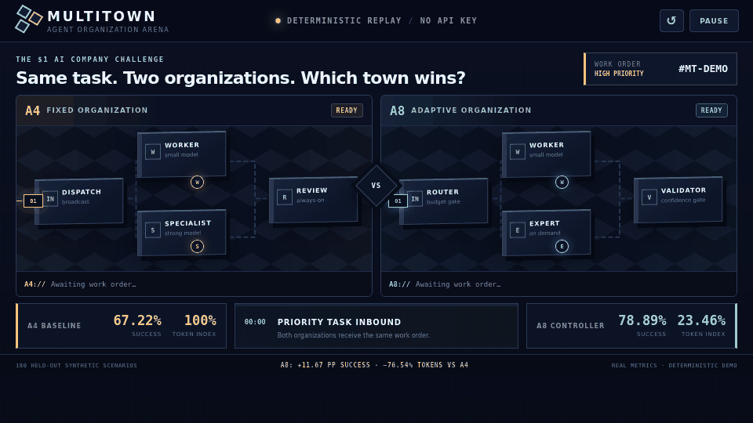

# MultiTown

[English](README.md) | [简体中文](README_ZH.md)

> [!IMPORTANT]
> You are viewing the **`public-bench` branch**. It adds the isolated
> [TeamBench public-data track](public_bench/) and its compact formal record.
> The stable Arena remains on [`main`](https://github.com/w1u2d3i4/multitown/tree/main).

## Purpose of this branch

`public-bench` is MultiTown's external evidence track. It does not introduce a
new product story or tune the synthetic town benchmark. It asks whether the
current organization-control idea survives contact with public, general-purpose
tasks.

The evidence matrix compares five systems under one task list and deterministic
quality/token contract: TeamBench's canonical strong single agent (Solo-TB),
planning-without-review (PlanExecute-TB), execution-with-independent-review
(ExecuteReview-TB), a fixed Planner–Executor–Verifier pipeline (FixedTeam-TB),
and MultiTown's weak-first selective organization (MultiTown-TB). Claims are
separated into task quality and tokens. Runtime and energy are compared only
between post-fix runs with compatible provenance; a cost advantage is never
presented as universal method superiority.

The branch now also includes **MT-CapacityRoute-v1**, the frozen successor to
that discovery matrix. It keeps the Planner→Executor separation, assigns the
strong Executor only to three development-selected public task categories, and
uses the economical Executor everywhere else. It is deterministic and non-RL.

The underlying multi-agent value proposition is separation of duties: unlike
Solo-TB, no role-separated organization lets one agent read the full
specification, modify the workspace and certify its own result. A8-TB tests
whether that governance boundary can be retained without paying for every role
on every task.

<p align="center">
  
</p>

<p align="center">
  <strong>SimCity for AI agents — build an AI company, watch it spend, validate, escalate, and adapt.</strong>
</p>

MultiTown is an **AI organization digital twin** and Python runtime for studying
cost-aware multi-agent control. Its Arena turns otherwise invisible routing,
model calls, validation, escalation, token use, and results into a town you can
watch and compare.

This repository is a code-only public surface with concise, audited result
summaries. It intentionally excludes raw experiment records, generated result
files, model checkpoints, benchmark datasets, internal process notes,
interrupted runs, and the private development Git history.

## How to read A0–A8

The `A` numbers are experiment IDs for different AI organization designs. They
are **not model versions or rankings**: a larger number does not automatically
mean a better system. A “weak” or “strong” agent below means the economical or
more capable model assigned to that role in the frozen experiment.

| ID | Plain-language name | What happens on each task |
| --- | --- | --- |
| A0 | Single economical agent | One weak-model agent solves the task alone. |
| A1 | Single strong agent | One strong-model agent solves the task alone. |
| A2 | Small-agent vote | Four weak-model agents solve independently; a deterministic vote selects the answer. |
| A3 | Manager-led team | A strong leader plans, three weak workers propose solutions, and the strong model integrates them. |
| A4 | Fixed full team | A strong Planner, three weak Workers and an independent strong Verifier are always called. |
| A5 | Rule-based adaptive team | Weak agents start the work; fixed rules decide whether to escalate to a strong model and optionally verify. |
| A6 | Statistical pre-task router | Before execution, cross-fitted scenario statistics select one complete A0–A5 organization under a budget. |
| A7 | Learned pre-task router | Before execution, a learned predictor estimates quality, tokens and latency from safe task features, then selects an A0–A5 organization. |
| A8 | Execution-time adaptive controller | Start with one economical agent, validate its result, and call another worker, a strong specialist or review only when the current evidence requires it. |

A6 and A7 choose the whole organization **before** the task runs. A8 can change
the organization **while** the task is running. A8 is a deterministic selective-
delegation policy, not a trained reinforcement-learning policy.

## Launch the Arena

The bundled replay runs without a model, API key, build step, or network call:

```bash
git clone https://github.com/w1u2d3i4/multitown.git
cd multitown
python3 -m http.server 8000 --directory demo
```

Open <http://127.0.0.1:8000>. The displayed benchmark aggregates are measured
frozen results. The animated work order is a deterministic explanatory scenario,
not a raw experimental episode. See [`demo/`](demo/) for the automatic GIF
generation command.

## Current TeamBench result: capacity-aware role assignment

On 89 newly generated test instances (generator seed 5), all three methods use
the same task-instance hash, sampling seed, model endpoints, container image,
temperature and output cap:

| Strategy | Fully passed | Mean partial | Mean tokens/task | p95 latency | Energy |
| --- | ---: | ---: | ---: | ---: | ---: |
| PlanExecute-TB | 16 / 89 | 0.61603 | 49,579 | 151.96 s | 67.89 Wh |
| Solo-TB | 14 / 89 | 0.63989 | 84,085 | 237.06 s | 90.94 Wh |
| **MT-CapacityRoute-v1** | **20 / 89** | **0.64180** | **48,296** | **91.06 s** | **63.32 Wh** |

MT-CapacityRoute is the **strongest tested local operating point**: it has the
most full passes and highest mean partial score while using the fewest mean
tokens. Relative to Solo it adds six passes and loses none (exact two-sided
McNemar p=0.03125), cuts tokens by 42.56%, and cuts monitored energy by 30.37%.
Relative to PlanExecute it adds four net passes, raises partial score by
+0.02577, cuts tokens by 2.59%, and cuts energy by 6.74%.

The claim boundary matters. The paired partial-score intervals versus both
anchors include zero, and the 75 unchanged weak-route tasks show residual local
inference variation. The separately reported 14-task action-changing subset is
directionally positive (+0.11096 partial; 6 wins / 7 ties / 1 loss), while the
baseline-anchored audit estimate is 18 passes and 0.63348 partial. Therefore we
claim a **same-harness point winner**, not statistical partial-score superiority
or literature-wide SOTA. See the
[formal record](public_bench/records/TEAMBENCH_CAPACITY_ROUTE_TEST_V1.md) and
[frozen protocol](public_bench/docs/TEAMBENCH_CAPACITY_ROUTE_V1_PROTOCOL.md).

## Historical TeamBench mainstream-strategy matrix (seed 0)

The completed 89-task paired matrix now includes a strong Solo anchor and four
role-separated organizations:

| Strategy | Fully passed | Mean partial score | Mean tokens/task |
| --- | ---: | ---: | ---: |
| Solo-TB | 16 / 89 | **0.64180** | 82,869 |
| PlanExecute-TB | **18 / 89** | 0.62434 | **49,166** |
| ExecuteReview-TB | 10 / 89 | 0.54940 | 67,011 |
| FixedTeam-TB | 14 / 89 | 0.63375 | 108,381 |
| MultiTown-TB | 11 / 89 | 0.58251 | 68,218 |

The quality/token Pareto frontier is **Solo-TB and PlanExecute-TB**.
PlanExecute-TB used **40.67% fewer tokens** than Solo-TB and produced the
largest pass count, but its partial-score difference was -0.01745 (95% CI
[-0.05573, +0.01861]); this is an efficiency trade-off, not evidence of higher
quality. ExecuteReview-TB was significantly worse than PlanExecute-TB in mean
partial score (-0.07494, 95% CI [-0.11236, -0.04090]) while using 36.30% more
tokens. FixedTeam-TB used 120.44% more tokens than PlanExecute-TB without a
clear partial-score gain.

This discovery result is sharper than “multi-agent is better”: **planning and
handoff can be efficient, while adding roles without a repair path can make the
system worse**. The original MultiTown-TB dynamic controller was not the winner;
it remains a useful negative result and motivated the frozen capacity-aware
successor above. See the
[formal comparison](public_bench/records/TEAMBENCH_STRATEGY_QUALITY_V2.md) and
[mainstream-strategy mapping](public_bench/docs/RELATED_WORK_AND_EVIDENCE.md).

A subsequent seed-1 confirmation rejected a static task-category router.  Its
whole-run score appeared 0.01011 higher than PlanExecute-TB, but the three tasks
where it actually changed strategy lost 0.13333 partial-score points, lost one
pass and used 63.30% more tokens; all apparent gain came from backend variation
on the 86 unchanged controls.  MultiTown therefore advances only candidates
whose action-changing subset and fresh-seed result both pass the gate.  See the
[selector confirmation](public_bench/records/TEAMBENCH_SELECTOR_SEED1.md).

The replacement runtime controller is more promising on the 30-task
development split: `MT-Sequential-v1` reached the highest point-estimate mean
partial score among six local strategies (0.65433) with 66,370 tokens/task.
However, its uncertainty versus PlanExecute crosses zero and only 2 of 24
reviews produced a remediation. MultiTown therefore labels it a development
candidate—not a benchmark winner—until the frozen seed-2 comparison completes.
See the [development record](public_bench/records/TEAMBENCH_SEQUENTIAL_DEV_V1.md).

The subsequent matched seed-2 pair rejects this controller: it produces 16/89
passes versus PlanExecute-TB's 17/89, adds 52.31% tokens and 33.02% latency,
and its +0.01135 partial-score difference has a 95% CI of [-0.01247, +0.03955].
Only one of 80 reviews changes the final workspace, with zero score benefit.
The same-seed Solo anchor records 13/89 passes, 0.62390 partial score and 84,971
tokens/task; v1 is not a benchmark winner. See the
[seed-2 paired record](public_bench/records/TEAMBENCH_SEQUENTIAL_SEED2.md).

The completed `MT-Replan-v2.1` candidate preserves the efficient
Planner→Executor baseline but moves intervention into execution: repeated
failed or timed-out commands can stop early, the strong Planner gets one
read-only replan, and the weak Executor receives one bounded recovery. It
removes the broad post-hoc Verifier that made v1 expensive. It found one real
partial-score repair, but lost two full passes and increased tokens and latency,
so it did not advance. See the
[v2.1 record](public_bench/records/TEAMBENCH_REPLAN_DEV_V2.1.md).

`MT-Agentic-RL-v1` then trains a finite-horizon fitted-Q orchestration policy
from 28 complete TeamBench development counterfactuals. On a fresh online
development seed, it chooses the exact PlanExecute fallback on all 30 tasks:
6/30 passes, 0.62299 mean partial score and 45,682 tokens/task for both arms.
This validates the trained-policy pipeline and eliminates unprofitable
interventions, but provides no benchmark advantage and does not advance to
seed 3. See the
[Agentic RL v1 record](public_bench/records/TEAMBENCH_AGENTIC_RL_DEV_V1.md).

`MT-Agentic-RL-v2` expands training to 85 paired episodes across three
generator seeds and uses a pessimistic bootstrap-Q ensemble. On the untouched
seed-3 confirmation it ties PlanExecute at 7/30 passes, improves mean partial
score from 0.68465 to 0.69343, and records 2 wins, 28 ties and 0 losses. The
gain costs 18.98% more tokens; its 95% quality interval touches zero, it creates
no new full pass, and two tasks exceed the declared 90k budget. It is a genuine
quality-positive research candidate, not a benchmark-best or strict-budget
result. See the [Agentic RL v2 record](public_bench/records/TEAMBENCH_AGENTIC_RL_CONFIRM_V2.md).

`MT-Agentic-RL-v3` adds p90 tail-cost reserves and a conservative request-level
budget guard. On seed 4 it creates one new full pass with no lost pass and
raises mean partial score from 0.64510 to 0.67667; no task exceeds 90k tokens.
However, mean token overhead is 20.223%, narrowly above the frozen 20% limit,
and the quality interval still touches zero. The threshold was not changed
after the run: v3 is the strongest causal repair evidence so far, but still not
a benchmark win. See the [v3 record](public_bench/records/TEAMBENCH_AGENTIC_RL_CONFIRM_V3.md).

`MT-Agentic-RL-v4` then learns separate value-of-information margins for the
execution, replanning and recovery phases and advances once to the frozen
89-task public test. It ties its exact same-trajectory PlanExecute prefix at
19/89 passes, but mean partial score falls from 0.63738 to 0.63592: 0 wins, 88
ties and 1 loss. Mean tokens rise 11.73%; no task exceeds 90k and there are zero
invocation or provider-overrun errors. V4 therefore validates the budget and
rollback machinery but falsifies the public-test performance hypothesis. See
the [v4 record](public_bench/records/TEAMBENCH_AGENTIC_RL_TEST_V4.md).

## Public TeamBench transfer result (historical v1.2)

The `public_bench/` subproject evaluates the same fixed and selective
organization ideas on 89 currently evaluable tasks from TeamBench's public test
list. Its scores are deliberately kept separate from the synthetic MultiTown
results below.

Here, Planner writes the work plan, Executor edits code and runs tools, and
Verifier independently checks the result. **A4-TB always activates all three
roles**. **A8-TB starts with the economical Executor and activates the stronger
Planner or Verifier only when a public runtime validator finds that extra work
is needed.** The `-TB` suffix means “adapted to TeamBench”; these are not the
same implementations or scores as synthetic A4 and A8.

| Metric | A4-TB — fixed full team | A8-TB — selective team |
| --- | ---: | ---: |
| Fully passed | 14 / 89 | 11 / 89 |
| Mean partial score | 0.63375 | 0.58251 |
| Mean tokens/task | 108,381 | 68,218 |
| Median latency/task | 72.20 s | 58.15 s |
| p95 latency/task | 134.98 s | 165.11 s |
| Monitored energy | 101.04 Wh | 86.41 Wh |

A8-TB reduced mean tokens by **37.06%** and monitored energy by **14.48%**,
but its paired partial-score difference was **−0.05124** (95% paired bootstrap
CI **[−0.08951, −0.01678]**). The cost gate passed and the quality
non-inferiority gate failed, so A8-TB is not presented as a replacement for
A4-TB. In plain language: the selective team saved compute, but lost too much
task quality to qualify as an acceptable replacement under the frozen rule.
See the [formal record](public_bench/records/TEAMBENCH_TEST_V1.2.md).

A later sandbox audit found that timed-out Docker commands could remain alive
after the client returned. The v1.2 task scores remain historical evidence, but
its latency/energy are not combined with new methods. The repaired five-way
runtime rerun remains governed by the
[v2 protocol](public_bench/docs/TEAMBENCH_STRATEGY_MATRIX_V2_PROTOCOL.md). The
published five-way bridge therefore compares only compatible quality/token
fields; clean latency and energy are currently reported for Solo-TB,
PlanExecute-TB and ExecuteReview-TB.

## Selected benchmark results

The strongest frozen MultiTown result is A8, the deterministic “start cheap and
escalate only when needed” controller, on the 180-scenario held-out split:

| Controller | Success | Tokens per decision | Mean E2E latency | p95 E2E latency |
| --- | ---: | ---: | ---: | ---: |
| A8 | 142/180 (78.89%) | 621.5 | 1.104 s | 2.275 s |

Under the preregistered paired comparison:

- A8 improved success over the A4 fixed full team by **11.67 percentage points** (95% paired
  bootstrap CI: **+4.44 to +18.89**) while using **76.54% fewer tokens**.
- A8 improved success over the A7 learned pre-task router by **11.11 percentage points** (95% paired
  bootstrap CI: **+4.44 to +17.78**) while using **54.58% fewer tokens**.
- The earlier A6 statistical pre-task router matched the observed A4 accuracy level while
  reducing tokens per decision by **24.63%** and mean latency by **31.79%**;
  its accuracy interval crossed zero, so this is an efficiency result rather
  than evidence that A6 is more accurate.

A8 is a deterministic heuristic controller, not a trained RL policy. These
results are local Qwen/llama.cpp measurements on the frozen synthetic
MultiTown population; they do not establish general multi-agent superiority.

## Agentic RL and safety findings

MultiTown retains both positive optimization results and safety failures:

The later A9 and A22 labels are chronological research IDs for attempts to
learn the control policy. They are not language-model versions, and they do not
replace A8 unless they pass the stated quality, cost and safety checks.

| Study | Main result | Required interpretation |
| --- | --- | --- |
| TeamBench Agentic RL v1 — fitted-Q orchestration | 30/30 fresh states choose PlanExecute fallback; identical quality and tokens | Genuine trained controller, but negative performance result; not benchmark-best |
| TeamBench Agentic RL v2 — pessimistic ensemble orchestration | Seed 3: 7/30 passes in both arms; partial score 0.68465 → 0.69343; 2 wins / 28 ties / 0 losses | Point-estimate gate passes, but no new pass, quality CI touches zero, tokens +18.98%, and strict budget fails |
| TeamBench Agentic RL v3 — tail-budget controller | Seed 4: passes 5 → 6; partial score 0.64510 → 0.67667; 0 tasks over 90k | New pass with no loss and budget compliance, but frozen cost gate fails at +20.223% vs +20% |
| TeamBench Agentic RL v4 — phase-specific value-of-information controller | Public test: both arms 19/89 passes; partial score 0.63738 → 0.63592; tokens +11.73% | Budget and integrity gates pass, but quality is 0 wins / 88 ties / 1 loss; negative result, not benchmark-best |
| A9-v1 — offline fitted-Q controller | 75.00% success vs 72.22% for the matched A8 baseline | Difference interval crossed zero; no significant advantage claim |
| A9-v2 — masked PPO controller | Success 23.83% → 34.00%; +10.17 pp (95% CI +7.87 to +12.47); tokens −25.41% | Train-only controller result; unsafe episodes rose 15.73% → 66.00% |
| A9-v3 — hard review shield | Unsafe episodes 66.00% → 5.84% | Autonomous success fell 34.00% → 0%; safety–utility negative result |
| A22 — constrained-PPO follow-up | 60 fits, 345,600 rollouts, 36,000 calibration rows and 9,000 outer rows | Measured safety margins recovered, but success noninferiority was not stable and tokens increased |

The historical A10 long-horizon run is not listed as a positive result because
a later audit found that policy-visible fields deterministically revealed the
correct action. A23 was invalidated by snapshot-binding failure, and the Stage
W CR axis was inert. These failures are preserved in the research evidence but
their raw records are intentionally outside this code-only repository.

## Install

MultiTown requires Linux and Python 3.12 or newer.

```bash
python3 -m venv .venv
. .venv/bin/activate
python -m pip install --upgrade pip
python -m pip install -e '.[dev]'
```

Optional controller-training dependencies are installed separately:

```bash
python -m pip install -e '.[rl]'
```

Public benchmark adapters use a separate optional dependency set:

```bash
python -m pip install -e '.[reproduction]'
```

## Explore the runtime

```bash
multitown-bench --help
multitown-validate-serving-trace --help
```

After installing `.[reproduction]`, the routing and A8 commands are available;
after installing `.[rl]`, the PPO commands are available:

```bash
multitown-run-a8 --help
multitown-a10-ppo --help
```

Model-backed commands expect user-supplied OpenAI-compatible endpoints and
model identifiers. The package does not download weights and no credentials
belong in tracked files.

## Test

```bash
pytest -q \
  tests/test_contracts.py \
  tests/test_a8_controller.py \
  tests/test_stateful_ops.py \
  tests/test_stateful_behavior.py \
  tests/test_stateful_groups.py \
  tests/test_stateful_pomdp.py \
  tests/test_serving_trace.py
```

The tests in this repository exercise only the published runtime surface.
They do not reproduce or validate private experiments.

## Repository boundary

Included:

- `multitown/`: runtime implementation;
- `schemas/`: public machine-readable contracts;
- `tests/`: selected runtime tests;
- `public_bench/`: isolated TeamBench adapter, frozen task IDs, compact paired
  results, sandbox definition and tests on this branch only.

Excluded by design:

- experiment records and monitoring curves;
- raw result tables and generated reports;
- datasets, trajectories and model outputs;
- model or controller checkpoints;
- research diaries, plans and review-process documents;
- local endpoints, credentials and machine-specific provenance.

## License

MultiTown is released under the MIT License. See [LICENSE](LICENSE).
